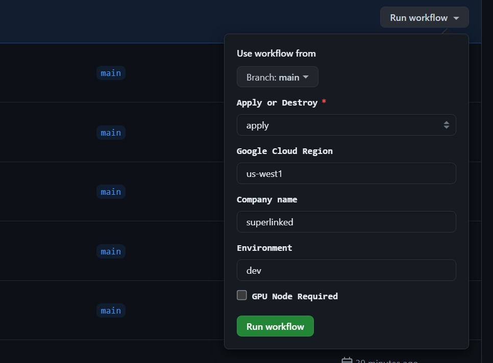
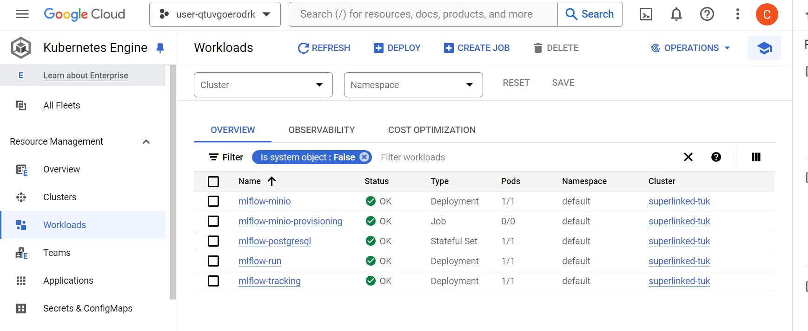

# Homework Exercise: Deploying a Streamlit or MLflow Service on GCP with Terraform

### Objective:
The goal of this exercise is to assess your ability to use Terraform to automate the deployment of a Streamlit or MLflow service on Google Cloud Platform (GCP). The service should be accessible via a public URL, capable of running on GPU instances, and as an optional extra, include user authentication. Additionally, you will need to create a Google Cloud Storage (GCS) bucket that the service can access through a service account.

### Requirements:

#### Service Deployment:

Choose either Streamlit or MLflow.
Deploy the chosen service and their related extra services (like metadata server, etc.) on GCP using Terraform.
Ensure the service is accessible via a public URL.
Ensure that the service has the option to run on GPU backed instances, based on the configuration.
EXTRA: Implement user authentication of your choice for accessing the service.

#### GCS Bucket:

Create a non-public GCS bucket using Terraform. The name should contain some sort of hash to avoid name collision.
Ensure the service can access the GCS bucket through a service account.
Best Practices:

Adhere to Infrastructure as Code (IaC) and Terraform best practices.
Organize your Terraform code into modules where appropriate.
Use variables and outputs effectively.
Ensure your code is idempotent and can be run multiple times without unintended side effects.

### Deliverables:

#### Terraform Code:

Provide all Terraform code required to deploy the service and create the GCS bucket.
Include a SOLUTION.md file with instructions on how to use the Terraform code, including any prerequisites and steps to deploy the infrastructure.
Documentation:

Describe the architecture of your solution.
EXTRA: Explain how you implemented user authentication and why you chose that route.
Detail any assumptions or decisions made during the implementation.

### Evaluation Criteria:

Correctness: The Terraform code should correctly deploy the service and create the GCS bucket as specified.
Best Practices: The code should follow Terraform and IaC best practices.
Documentation: Clear and comprehensive documentation.
Reusability: The code should be modular and reusable.
Security: Proper implementation of user authentication and secure access to the GCS bucket.

### Submission:

Please submit your Terraform code and documentation in this GitHub repository, on your own branch. We will check your final submission the day before the interview.

Good luck, and we look forward to reviewing your solution!

# SOLUTION:

# 🚀 How to Use:

1. Create a SP

2. Generate a JSON key
   
4. Upload it as `JSON` Repository secret

5. Upload the project_id as `PROJECTID` Repository secret

6. Trigger the workflow manually from the Actions tab in the GitHub repository

7. Enjoy your MLFLow!

# Resources Created

Google Kubernetes Engine (GKE) Cluster: Managed Kubernetes cluster to run containerized applications.

Google Compute Network: Custom VPC network to manage network traffic.

Google Compute Subnetwork: Subnets within the VPC to segment the network.

Google Storage Bucket: Object storage to store and retrieve any amount of data.

Google Storage Bucket: Object storage to store terraform state.

# 🔄 GitHub Actions Workflow

This repository includes a GitHub Actions workflow for deploying and destroying the Terraform infrastructure.

### Workflow: Deploy/Destroy Terraform

- **Trigger**: Manual (workflow_dispatch)
- **Inputs**:
  - `terraform-action`: Choose between 'apply' or 'destroy'
  - `google-loud-region`: GCP region (default: 'germanywestcentral')
  - `company`: Company name (default: 'spatially')
  - `environment`: Environment name (default: 'dev')
  - `gpu-node-required`: GPU Node Required (default: 'fasle')

### Key Steps:

1. Checkout repository
2. Install Terraform
3. Azure Login
4. Ensure Resource Group exists
5. Check/Create Azure Storage Account
6. Initialize Terraform
7. Format and Validate Terraform files
8. Plan Terraform changes
9. Apply or Destroy based on input

### Additional Features:

- Publishes Terraform plan as an artifact
- Creates a pull request for any automated formatting changes

# Pics

